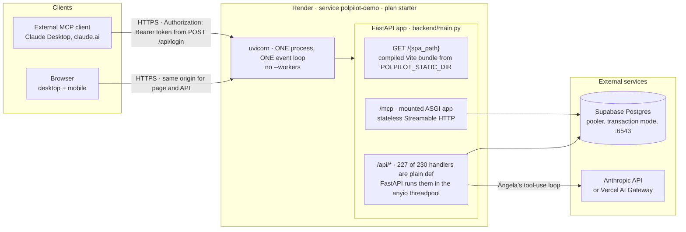
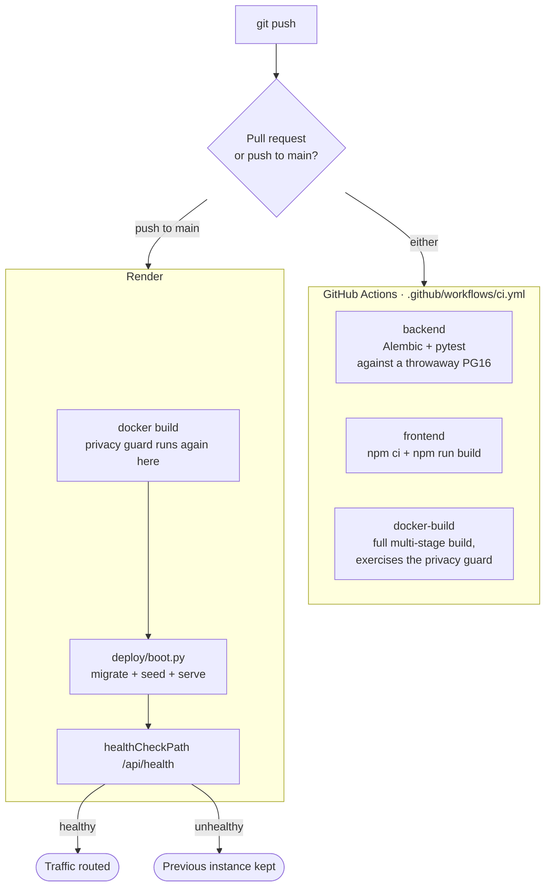
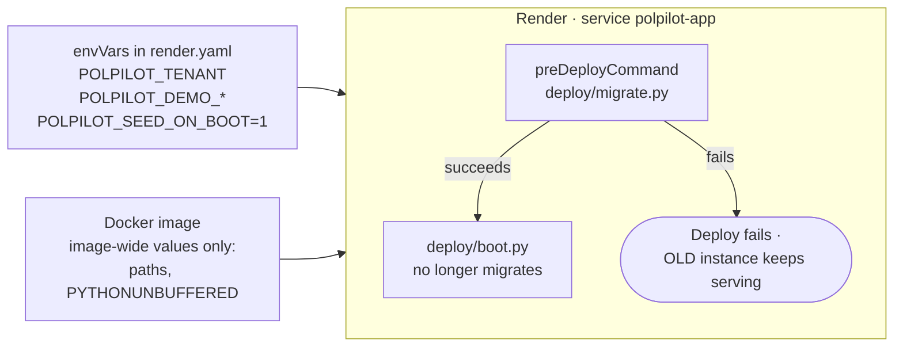
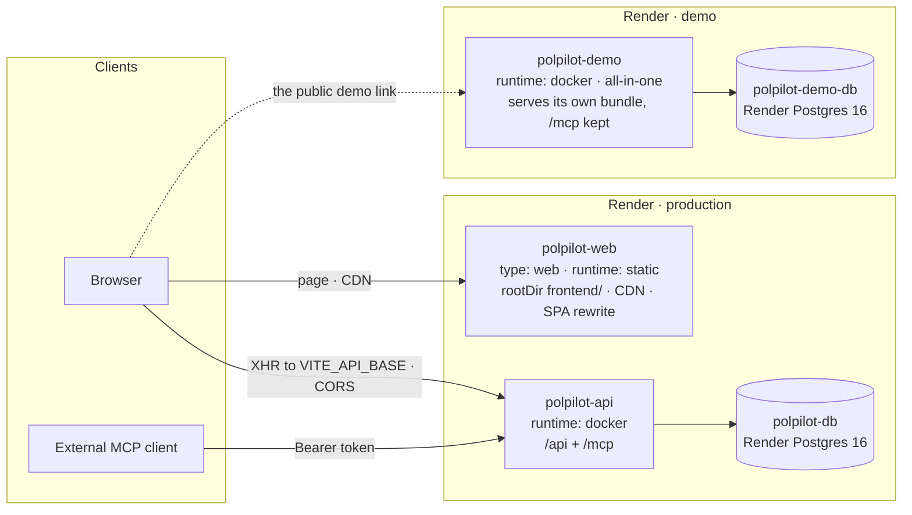

# Deployment architecture

How PolPilot is deployed, why it is shaped that way, and what it should
become. Three sections, in order of how real they are:

| Section | Status |
|---|---|
| [1 · Today](#1--today-as-deployed) | **Live.** What is running on Render right now. |
| [2 · After this branch](#2--after-this-branch) | **Planned, not deployed.** See the design in `docs/superpowers/specs/2026-09-04-render-deployment-productive-design.md`. |
| [3 · The target](#3--the-target-architecture) | **Documented, not built.** Deliberately deferred — the trigger is in [§3.3](#33--when-to-actually-build-it). |

The operational runbook — secrets, the post-deploy checklist, how to reset
the demo, what to do when something breaks — lives in `DEPLOY.md`. This file
is the *why* and the shape.

---

## 1 · Today (as deployed)

One Render web service, built from the root `Dockerfile`, serving everything
on one port. Postgres is external (Supabase). The LLM is external
(Anthropic, or the Vercel AI Gateway — chosen by configuration in
`backend/config.py`, never by a caller).

### 1.1 · Runtime topology

Three things about this diagram matter more than the boxes:

**One origin.** The browser fetches the page and the API from the same host,
because the backend serves the compiled bundle itself
(`backend/main.py:3468`). Every call in `frontend/src/lib/` is a hard-coded
relative path — `fetch("/api/login")`, `fetch("/api/angela/stream")`. There
is no `VITE_*` base URL anywhere in `frontend/src`. In development,
`vite.config.js` proxies `/api` to `127.0.0.1:8000` to reproduce that same
single-origin shape.

**One event loop, and an asymmetry on it.** `/api/*` handlers are plain
`def`, so FastAPI hands them to a threadpool and they never block the loop.
The `/mcp` path does not have that property: `mcp_server.py:143` is an
`async def` that calls `angela._run_tool` synchronously. On a single uvicorn
worker, one MCP client calling a heavy tool stalls every concurrent web
request, the `/api/angela/stream` chat stream included. This is finding F2
in the design doc, and §2 fixes it.

**Two database roles, on purpose.** `DATABASE_URL` is the elevated/owner
connection used by Alembic and by tenant-row lookups. `APP_DATABASE_URL` is
a role with `NOBYPASSRLS`, and every tenant-scoped query goes through it
(`backend/core/db/engine.py`). Pointing both at the same elevated role would
make Row-Level Security silently do nothing, with no visible error.

### 1.2 · One process serves one tenant

Tenancy is per *deployment*, not per request:

```mermaid
flowchart TB
    env["POLPILOT_TENANT · read once from env<br/>core/paths.py:22, defaults to demo"]
    tid["current_tenant_id&#40;&#41;<br/>core/db/tenant.py · @lru_cache&#40;maxsize=1&#41;"]
    rls["Every tenant-scoped query<br/>tenant_connection&#40;tenant_id&#41; + RLS policies"]
    dir["POLPILOT_DATA_DIR<br/>seed source, per-tenant directory"]

    env --> tid --> rls
    env --> dir
```

`core/db/tenant.py`'s own docstring puts it plainly: *"one process still
serves one tenant."* So a second tenant is a second service with a different
`POLPILOT_TENANT`, not a routing layer. That is the whole reason the design
doc rejects folding the demo into a shared multi-tenant process (D5): the
cached global is what RLS scoping depends on, so making it per-request is a
security-boundary refactor.

### 1.3 · Boot sequence

`deploy/boot.py` is the container's entrypoint. The server never comes up
without data — if any step fails the process exits, the healthcheck fails,
and Render does not route traffic to it.

```mermaid
flowchart TB
    start(["Container starts<br/>CMD python deploy/boot.py"]) --> mig
    mig["1 · alembic upgrade head"] --> ensure
    ensure["2 · seed_db.ensure_tenant&#40;&#41;<br/>the tenants row must exist BEFORE step 3"] --> gen
    gen["3 · generar.py<br/>regenerates the synthetic dataset, deterministic"] --> seed
    seed["4 · seed_db.run&#40;&#41;<br/>auth_credentials + every migrated domain"] --> verify
    verify["5 · hard check: inventory is non-empty IN POSTGRES"] --> canon
    canon["6 · copy DATA_DIR to POLPILOT_CANONICAL_DIR<br/>backs the admin reset endpoint"] --> serve
    serve(["7 · exec uvicorn on $PORT"])

    mig -->|"any step fails"| die(["exit 1 · healthcheck fails<br/>Render does not publish"])
    gen -->|fails| die
    seed -->|fails| die
    verify -->|fails| die
```

Step 2 before step 3 is not cosmetic: `generar.py` calls directly into
Postgres-backed `core/` modules partway through its own seeding, and those
raise if the tenant has no row yet. A repeated boot masks it — the row
already exists from last time — so it only bites on a genuinely fresh
database.

Two consequences of steps 3–4 running on **every** boot: Render's ephemeral
filesystem means each restart or redeploy returns the demo to its canonical
state for free, and — the dangerous half — this same entrypoint would
regenerate a *productive* tenant's dataset. That is why §2 gates it.

### 1.4 · The pipeline

CI and Render build the image independently — nothing is promoted from CI to
Render. Render builds from the repo on its own. That means **CI is advisory,
not a gate**: a red `main` still deploys. Worth knowing before trusting the
green check.

The privacy guard runs in both places. It is a `RUN` step inside the
`Dockerfile` that fails the build if another tenant's data, an asset, a
`.env`, or credentials reached the image — including a `grep` over the
compiled `frontend/dist` bundle, added after a real incident where the old
guard never inspected the bundle and missed a leaked logo and embedded data.

### 1.5 · Configuration surface

| | Where it lives today | |
|---|---|---|
| `ANTHROPIC_API_KEY` | Render dashboard, `sync: false` | secret |
| `POLPILOT_RESET_TOKEN` | Render dashboard, `sync: false` | secret · guards `/api/admin/reset-demo` |
| `DATABASE_URL` | Render dashboard, `sync: false` | secret · Supabase, owner role |
| `APP_DATABASE_URL` | Render dashboard, `sync: false` | secret · `NOBYPASSRLS` role |
| `ANGELA_MODEL` | `render.yaml`, literal | config, deliberately explicit |
| `POLPILOT_TENANT`, `POLPILOT_DEMO_*`, paths | **baked into the image** (`Dockerfile` `ENV`) | see below |

That last row is finding F1, and it is the reason this work exists. The
image hard-codes `POLPILOT_TENANT=demo` **and
`POLPILOT_DEMO_AUTOLOGIN=1`** — so any productive service built from the same
image comes up autologged-in as the tenant owner unless every one of those
is individually overridden by hand. The failure is silent, and it is an
unauthenticated production app.

---

## 2 · After this branch

The topology does not change: still one service. What changes is that the
image stops being demo-specific and the deploy stops being able to destroy
productive data.

Six changes, and what each one buys:

1. **Demo env moves out of the image into `render.yaml`'s `envVars`.** Fixes
   F1. This is what makes the pipeline "productive": the first paying client
   becomes a copy of the service block with a different `POLPILOT_TENANT`,
   instead of an audit of which demo defaults leaked in. The privacy guard is
   untouched and stays exactly as strict — productive data lives in Postgres,
   never in the image.

2. **`POLPILOT_TENANT` becomes mandatory at deploy time.** Because
   `core/paths.py:22` *defaults it to `"demo"`*, moving it out of the image
   would otherwise relocate F1 rather than fix it: a productive service that
   forgot to set it would silently serve the demo tenant. `migrate.py` and
   `boot.py` refuse to run without it. Local dev and the test suite never call
   those, so they keep the convenient default.

3. **Migrations move to `preDeployCommand`.** Today a failed migration exits
   the container and takes the service down. With a pre-deploy step the deploy
   fails cleanly and the old instance keeps serving. This is also the mechanism
   that stops two services racing on migrations under §3.

4. **Seeding is gated on `POLPILOT_SEED_ON_BOOT=1`**, set only on a demo
   service. `generar.py` on a productive tenant is data loss. The gate
   defaults to **off** so a service that forgets it fails safe.

5. **`asyncio.to_thread` on the MCP tool call.** Fixes F2 — the live
   event-loop stall. One line, plus the concurrency test whose absence is why
   it shipped.

6. **The database URL scheme is normalized** to `postgresql+psycopg://`.
   Render's connection strings are `postgresql://`, which SQLAlchemy maps to
   **psycopg2** — and only `psycopg` v3 is installed. Without this, the first
   query against any Render-provisioned database dies with
   `ModuleNotFoundError`. It is a no-op for the current hand-written Supabase
   URLs, and it turns a future database move into a URL swap.

Plus one forward-looking refactor: the ~15 scattered `fetch("/api/…")` call
sites in `frontend/src/lib/` collapse behind one client with a
`VITE_API_BASE` that defaults to `""`. Byte-identical request URLs, no
behavior change — its value is that §3's static-site split becomes a
`render.yaml` edit instead of a frontend refactor.

**The database stays on Supabase.** Greenfield (no productive data yet) means
moving is cheap whenever it happens, so there is no lock-in to escape and no
urgency; Supabase's free tier is $0 against roughly $6/month. The accepted
caveat: free Supabase projects pause after about a week idle, so an
untouched demo link may hit a cold database on first open.

---

## 3 · The target architecture

What to build when it pays for itself. This is documented rather than built —
the split's benefits accrue at traffic and revenue that do not exist yet,
while its costs are immediate and monthly.

### 3.1 · Topology

What each split buys, honestly:

- **`polpilot-web` as a static site** — the bundle served from Render's CDN
  instead of through uvicorn, and frontend-only deploys that never restart the
  API. Cost: two origins, so CORS must widen and the `/api/angela/stream`
  NDJSON stream has to be verified cross-origin with an `Authorization`
  header. That verification cannot be done honestly until two origins exist,
  which is why §2 lands the refactor but not this.
- **A separate demo service** — the public link cannot be affected by
  productive traffic or a productive deploy, and the demo keeps its
  reseed-every-boot behavior while production never seeds.
- **Render-managed Postgres** — connection strings come from `fromDatabase`
  references instead of four hand-pasted secrets that drift. One thing Render
  cannot do: `docker/init-app-role.sql` runs today only because the local
  `postgres:16` image executes `docker-entrypoint-initdb.d/*.sql`. A managed
  instance has no such hook, so the `NOBYPASSRLS` role has to be created by
  `deploy/migrate.py` instead. Migrations `0002`–`0011`+ do issue
  `FORCE ROW LEVEL SECURITY`, so even the owner is subject to RLS — but the
  restricted role still has to exist and still has to be the one the app
  connects as.

Naming note: `polpilot-demo` above is today's service, which §2 renames to
`polpilot-app`. Under the split it returns to demo-specific naming, because
that is what it will then be. Two renames rather than one is the price of not
knowing today whether a paying client arrives before the split does.

### 3.2 · MCP stays inside the API — permanently

This was investigated as a fourth service and rejected on the merits, so it
does not reappear as a later phase.

The isolation argument for splitting it is really finding F2, and F2's fix is
a threadpool hop. Splitting would only *relocate* the stall into the MCP
service, where a second client still blocks the first. Once F2 is fixed,
co-location holds up: `mcp_server.py` is **stateless** Streamable HTTP —
every request opens and closes its own internal session — so there is no
session affinity to arrange and it scales horizontally with the API.

The four things a separate service genuinely buys are independent scaling, a
separate auth/rate-limit surface, an independent deploy cadence, and a
separate domain. Here it is the same image, the same Postgres, the same code
and the same deploy — so only the fourth applies, and it reduces to
`api.…/mcp` versus `mcp.…`.

For context on "state of the art": the MCP specification is deliberately
silent on deployment topology. What *is* current practice is the transport,
and this code is already on it. The pattern of giving MCP its own service
comes from stateful SSE needing sticky routing, and from standalone MCP
servers where the MCP server *is* the product. PolPilot's is a facade over an
API it already runs — every tool delegates to `angela._run_tool` and computes
nothing of its own.

### 3.3 · When to actually build it

Not on a date — on a trigger. Any one of these is sufficient:

| Trigger | Which piece it justifies |
|---|---|
| A paying client on its own tenant | `polpilot-api` + `polpilot-db`, separate from the demo |
| Frontend deploys restarting the API becomes annoying | `polpilot-web` as a static site |
| Hand-pasted connection strings drift, or Supabase's idle pause bites | Render-managed Postgres |
| Sustained MCP traffic from real external clients | Revisit §3.2 with a metric — not before |

The migration stays cheap in the meantime *because* of §2: the image is
already tenant-agnostic, migrations already run as a pre-deploy step, the
frontend already routes through one configurable base URL, and the database
URL is already normalized. The split becomes a `render.yaml` edit plus the
CORS work, not a refactor.

### 3.4 · Cost

| | Today / §2 | §3 target |
|---|---|---|
| Web service | starter · ~$7 | api ~$7 + demo ~$7 |
| Static site | — | free |
| Postgres | Supabase free · $0 | prod ~$6–19 + demo ~$6 |
| **Monthly** | **~$7** | **~$33–46** |

Render Postgres has a 30-day free window, after which the basic tiers apply.

---

## 4 · Deliberately not done

Recorded so they are not re-litigated, with where the reasoning lives:

- **Per-request tenant routing** (one app serving demo and productive
  tenants). Rejected: D5. `current_tenant_id()` is an `lru_cache`d
  process-global and it is what RLS scoping depends on.
- **A separate MCP service.** Rejected: D3 and §3.2 above.
- **CORS widening and cross-origin stream verification.** Deferred: D11.
  Cannot be tested honestly with one origin.
- **Custom domains and DNS.** Out of scope: D7. Note that this is what would
  decouple the public URL from the service name for good.
- **Preview environments for pull requests.** Not costed or designed.
- **Promoting the CI-built image to Render** rather than letting Render
  rebuild. Would make CI a real gate (see §1.4), but needs a registry and
  is not part of this work.
